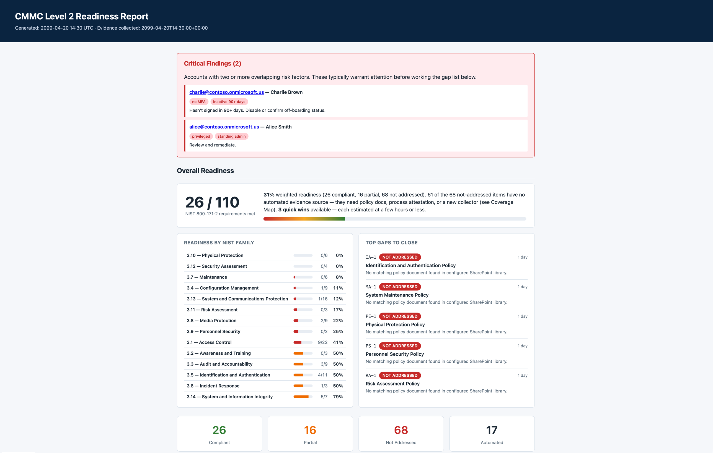

# CMMC GCC-High Evidence Collector

Open-source pre-assessment readiness tool for small Defense Industrial Base (DIB) contractors on Microsoft 365 GCC-High. Point it at your tenant; get back a self-contained HTML dashboard, a raw JSON evidence snapshot, and a prioritized remediation backlog for NIST 800-171 r2 / CMMC Level 2.

Built for the common small-DIB shape: 3-10 users, mixed endpoints (macOS / Windows / iOS / Android) managed by Intune, Defender for Endpoint, a single GCC-High tenant.



## What it does

1. Authenticates to the GCC-High Graph API (`graph.microsoft.us`) as an app-only principal.
2. Collects evidence in parallel from:
   - **Azure AD / Entra ID** — users, MFA registration, privileged role membership, conditional-access policies, directory audit events, risky sign-ins, password policy.
   - **Intune** — managed devices across all enrolled platforms (set `collectors.intune.filter_os` to scope), compliance state, compliance policies.
   - **Defender for Endpoint** — vulnerabilities, alerts (past 90 days), Secure Score; falls back to Intune antivirus signals when Defender Graph surfaces are not available.
   - **Exchange Online** — mailbox inventory, directory-audit events scoped to Exchange. (DLP policies require Security & Compliance PowerShell — flagged in the report if missing.)
   - **SharePoint policy library** — enumerates a configured document library and matches filenames against the 13 NIST policy-family controls.
3. Scores 28 measured controls (AC-1/2/3/6, AT-1, AU-1/2/3/6/12, CM-1, IA-1/2/4/5, IR-1/4, MA-1, MP-1, PE-1, PS-1, RA-1, SC-1/7, SI-1/2/3/4) each with `COMPLIANT` / `PARTIAL` / `NOT_ADDRESSED` status, evidence bullets, gaps, and remediation steps. The report's Coverage Map section correlates those 28 controls against **all 110 NIST 800-171r2 / CMMC Level 2 requirements** so you see exactly which requirements the tool covers with technical evidence, which are covered only by a policy-document match, and which are out of scope (with the reason, e.g. "physical process", "requires Purview", or a tracked enhancement issue).
4. Writes three files to `./reports/`:
   - `compliance-report.html` — interactive dashboard.
   - `evidence.json` — raw evidence from all collectors.
   - `remediation-backlog.json` — tasks bucketed into `quick_win` / `medium` / `heavy_lift`.

See [`reports/sample-report.html`](reports/sample-report.html) for a preview (rendered from `tests/sample_data.json` — no real tenant data).

## Quick start

The fastest path is the published Docker image — no clone, no Python, just one command:

```bash
mkdir cmmc-readiness && cd cmmc-readiness
docker run --rm -p 8080:8080 \
  -v "$(pwd)/data:/app/data" \
  ghcr.io/decisivellc/gcc-cmmc-collector:latest
```

Visit <http://localhost:8080>, sign in with your GCC-High app-registration credentials (or first run `bootstrap` — see below), and click **Run collection**.

The client secret is held only in the server process's memory for the duration of your session — it is never written to `config.json` or any disk file, and wipes on logout or container restart. Config, reports, evidence, and run history persist to `./data/` via the volume mount.

### Entra app registration

One-time setup per tenant. Two options:

- **Automated** (recommended): launches a device-code login, creates the Entra app, grants all 10 required permissions, mints a client secret, and writes tenant/client IDs to `config.json`. Sign in as a Global Administrator (PIM-activated is fine).

    ```bash
    docker run --rm -it -v "$(pwd)/data:/app/data" \
      ghcr.io/decisivellc/gcc-cmmc-collector:latest \
      python main.py bootstrap --tenant your-tenant.onmicrosoft.us
    # Copy the printed client secret — it won't be shown again.
    ```

- **Manual**: follow the 20-minute walkthrough in [`SETUP.md`](SETUP.md) to create the app registration, mint a secret, and grant each permission by hand.

### Run from source

For contributors or air-gapped installs:

```bash
git clone https://github.com/decisivellc/gcc-cmmc-collector.git
cd gcc-cmmc-collector
git checkout v0.1.0   # or 'main' for unreleased

# CLI
python3 -m venv .venv && source .venv/bin/activate
pip install -r requirements.txt
python main.py bootstrap --tenant your-tenant.onmicrosoft.us  # if needed
export CMMC_CLIENT_SECRET='<paste>'
python main.py --config config.json --output ./reports

# Or web UI built from local source
docker compose up --build
```

#### Dev mode (live reload)

```bash
CMMC_DEV=1 docker compose up --watch
```

`CMMC_DEV=1` turns on Flask debug mode and template auto-reload inside the container. `--watch` activates the `develop.watch` block in `docker-compose.yml` which syncs `web/`, `main.py`, `collectors/`, `mappers/`, `templates/`, and `graph_client.py` from host into the container on save and restarts the app. Edit a Python file or template, reload your browser — done. Requires Docker Compose v2.22+.

To run the Flask app directly on the host instead of in Docker:

```bash
CMMC_DEV=1 python -m web.app
```

The `client_secret` can also be provided via the `CMMC_CLIENT_SECRET` environment variable, which overrides the value in `config.json` — useful when you keep the config file in source control but want the secret elsewhere.

## Azure app registration

You need an Entra (Azure AD) app registration in the GCC-High tenant with the following **Application** Graph permissions (admin consent required):

- `User.Read.All`
- `Directory.Read.All`
- `AuditLog.Read.All`
- `Policy.Read.All`
- `IdentityRiskEvent.Read.All`
- `DeviceManagementManagedDevices.Read.All`
- `DeviceManagementConfiguration.Read.All`
- `SecurityEvents.Read.All`
- `ThreatIndicators.Read.All`
- `Sites.Read.All` — required for the SharePoint policy-document collector

Full step-by-step walkthrough: [`SETUP.md`](SETUP.md) and [`docs/app-registration-setup.md`](docs/app-registration-setup.md).

## Running the tests

```bash
pip install -r requirements.txt
python -m pytest -q
```

Fixtures in `tests/sample_data.json` drive the suite; no network access is required.

Render a fresh sample report from fixtures:

```bash
python tests/render_sample.py
```

## Project layout

```
main.py                     CLI entry, parallel collection, report generation
graph_client.py             MSAL auth + paginated GET against graph.microsoft.us
collectors/                 One module per system (Azure AD, Intune, Defender, Exchange)
mappers/nist_800_171.py     Raw evidence -> per-control status
templates/report.html       Jinja2 dashboard
tests/                      Fixtures and unit tests
docs/                       Setup, permissions, control mapping, FAQ
```

## Security notes

- `config.json` is gitignored; do not commit tenant secrets. `config.template.json` is the only version that should be in source control.
- The app registration needs only **read** permissions to produce this report.
- All Graph calls go to `https://graph.microsoft.us/v1.0`; the MSAL authority is `https://login.microsoftonline.us/{tenant_id}`. These are hard-coded defaults and configurable via `config.json`.

## License

[Apache 2.0](LICENSE).

## Contributing

Bug reports and PRs welcome at [github.com/decisivellc/gcc-cmmc-collector](https://github.com/decisivellc/gcc-cmmc-collector). Add fixtures to `tests/sample_data.json` when introducing new evidence signals.
